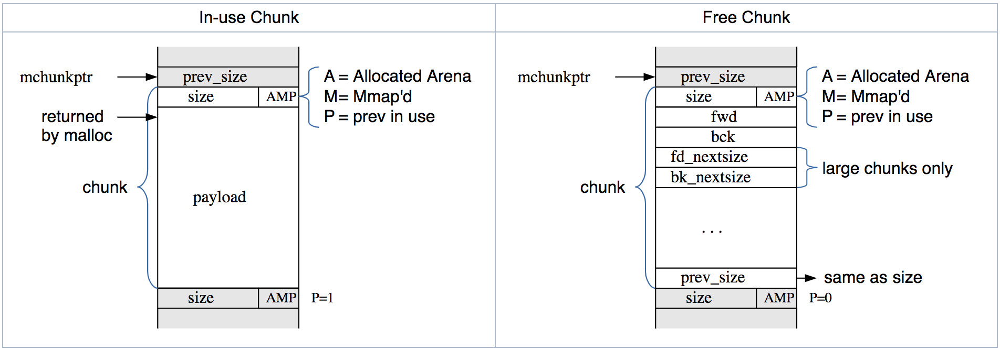

# Linux Heap Calloc Exploitation

**Author:** Silvio Cesare
**Source:** [https://blog.infosectcbr.com.au/2019/08/linux-heap-calloc-exploitation.html](https://blog.infosectcbr.com.au/2019/08/linux-heap-calloc-exploitation.html)

# Notes

- The heap chunks on modern GLibc 2.26 - 2.29 use the following heap structure taken from Malloc Internals just like the original article:

- When the `IS_MMAPED` bit is set inside of a heap chuck `calloc` does not zero the bytes
- Thus if an attacker can set the bit via an overflow / underflow / OOB Write in a chunk
  they can cause future allocations with `calloc` to return uninitialized data.

# Resources

- [http://tukan.farm/2016/10/14/scraps-of-notes/](http://tukan.farm/2016/10/14/scraps-of-notes/)
- [Malloc Internals](https://sourceware.org/glibc/wiki/MallocInternals)

# Running the Docker Container with the source

1. `docker build -t linux_heap_calloc_exploitation1 .`
1. `docker run -it linux_heap_calloc_exploitation1 /example`

The example code is transcribed from the original article.
